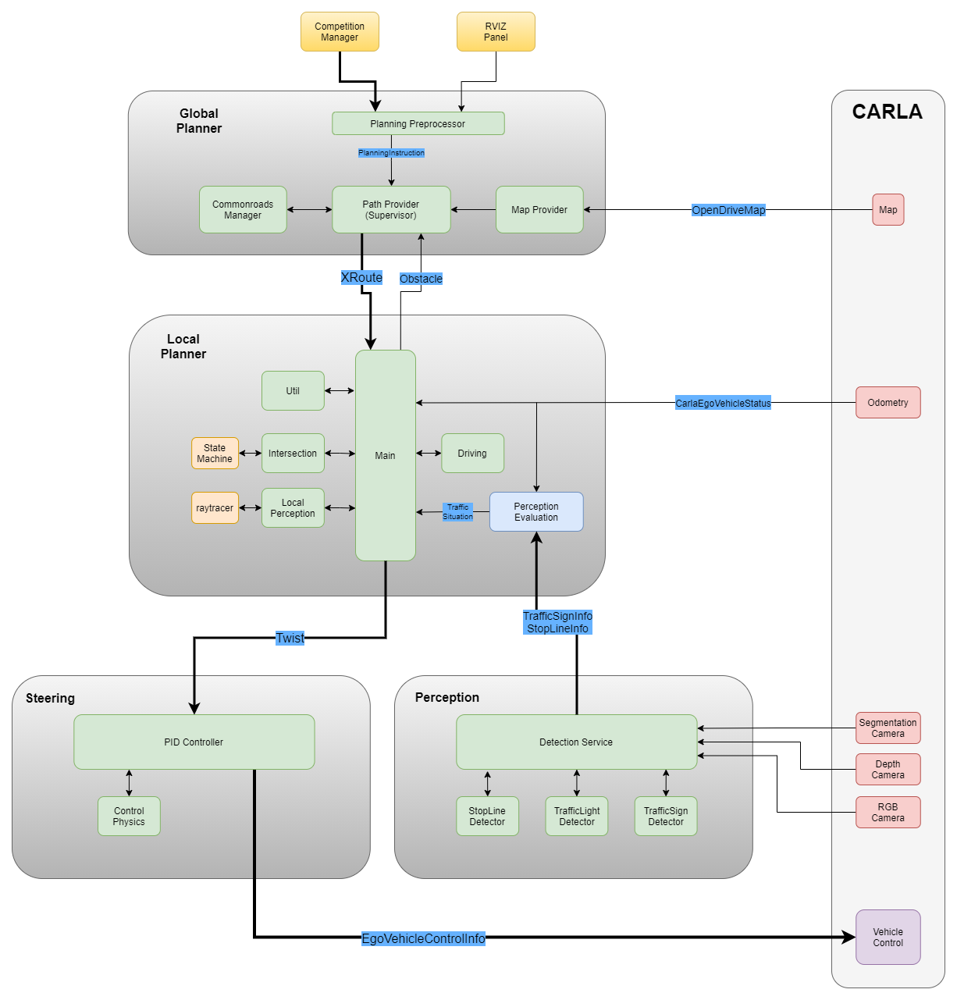

# PSAF WS20/21 Gruppe 1
Das Simulieren von autonomen Fahrzeugen ist ein wichtiger Bestandteil des Entwicklungsprozesses von autonomen Fahrzeugen. 
Durch Simulation kann ein System getestet und die Funktionen validiert und verifiziert werden. 
Dies ermöglicht Fehlererkennung, Fehlerlokalisierung und Fehleridentifizierung, sodass eine Optimierung des Systems erleichtert wird. 
In diesem Projekt soll ein autonomes Fahrzeug konzeptioniert und implementiert werden, welches mithilfe eines Simulators getestet werden kann.

## Inhalt
TODO

## Aufgabenstellung
Dieses Repository ist das Ergebnis der Veranstaltung „Praktikum: Simulation für autonome Fahrzeuge“ des Lehrstuhls für Mechatronik an der Universität Augsburg. 
Im Rahmen der Veranstaltung soll mithilfe der Simulationsumgebung [CARLA](http://carla.org/) ein autonomes Fahrzeug entwickelt werden. 

Die Aufgabe umfasst folgende Punkte:
1. Das Fahrzeug soll in ROS implementiert werden. Die [CARLA ROS bridge](https://github.com/carla-simulator/ros-bridge) dient hierbei als Schnittstelle zwischen CARLA und ROS.
2. Das Fahrzeug soll selbstständig eine Route berechnen können.
3. Das Fahrzeug muss selbständig vom Startpunkt zum Zielpunkt gelangen.
4. Das Fahrzeug muss Ampeln, STOP-Schilder und Geschwindigkeitsbegrenzungsschilder erkennen und darauf entsprechend reagieren können.
5. Das Fahrzeug befindet sich in einer Welt mit anderen Verkehrsteilnehmern (nur PKW).
6. Folgende CARLA Maps müssen unterstützt werden: Town 01, 02, 03 und 05
7. Als Farzeugmodell ist das Tesla Model 3 zu wählen
8. Eine Fahrt soll über den vorgegebenen [Comeptition Manager](https://github.com/ll7/psaf20/tree/main/psaf20_competition_manager) gestartet werden können.

## Übersicht der Ergebnisse

### Übersicht


### Abstraction Layer
TODO

### Global Planner
Die Hauptaufgabe des Global Planner besteht darin, einen Pfad vom der aktuellen Position zu einem Zielpunkt zu planen. Um dies zu bewerstelligen, müssen entsprechende Karteninformationen generiert, bzw. konvertiert und aufbereitet werden. Neben einer einfachen Abfolge von Wegpunkten enthält der Plan auch Informationen wie Geschwindigkeitsbeschränkungen oder Stoppschilder.
Nach der initialen Planung steht der Planer bereit, um dynamisch Neuzplanen, wenn beispielweise Hindernisse umfahren werden sollen.
 
Genauere Informationen sind dem Readme [Global Planner](psaf_ros/psaf_global_planner) zu entnehmen.

### Local Planner
Die Hauptaufgabe des Local Planner ist das Berechnen einer Geschwindigkeits- und einer Lenkwinkelvorgabe für das Fahrzeug. Hierbei werden Informationen aus dem 
Global Planner (Globaler Pfad, Geschwindigkeit auf Streckenabschnitten) oder der Perception (Ampeln, Stoppschilder) verwendet. Dadurch kann der Local Planner dem
globalem Pfad zum Ziel folgen und dabei Verkehrsregeln beachten. Zudem werden andere Fahrzeuge in der näheren Umgebung des eigenen Fahrzeugs auch in die Planung einbezogen.
Falls im Pfad Hindernisse wie langsamere Verkehrsteilnehmer auftreten kann der Local Planner eine Neuplanung beim Global Planner auslösen.
 
Genauere Informationen sind dem Readme [Local Planner](psaf_ros/psaf_local_planner) zu entnehmen. 

### Perception
Das Paket Perception ermöglicht es, Ampeln und ihren Zustand sowie Haltelinien zu erkennen. Hierzu werden kombinierte Kamerainformationen aus dem Paket Sensor Preprocessing verwendet. Um aus diesen Informationen Objekte zu Detektieren kommt das System [YOLO v3] zum Einsatz.
 
Genauere Informationen sind dem Readme [Perception](psaf_ros/psaf_perception) zu entnehmen. 

### Steering
### Starter

## Setup des Projektes

### Setup ROS Noetic and CARLA 0.9.10
``` bash
# ros noetic
# http://wiki.ros.org/noetic/Installation/Ubuntu
sudo sh -c 'echo "deb http://packages.ros.org/ros/ubuntu $(lsb_release -sc) main" > /etc/apt/sources.list.d/ros-latest.list'
sudo apt-key adv --keyserver 'hkp://keyserver.ubuntu.com:80' --recv-key C1CF6E31E6BADE8868B172B4F42ED6FBAB17C654
sudo apt update
sudo apt install ros-noetic-desktop-full
echo "source /opt/ros/noetic/setup.bash" >> ~/.bashrc
source ~/.bashrc

# carla0.9.10.1
cd ~/Downloads
wget https://carla-releases.s3.eu-west-3.amazonaws.com/Linux/CARLA_0.9.10.1.tar.gz
mkdir -p ~/carla0.9.10.1
tar -xf archive.tar.gz -C ~/carla0.9.10.1 # extract
echo "export PYTHONPATH=$PYTHONPATH:~/carla0.9.10.1/PythonAPI/carla/dist/carla-0.9.10-py3.7-linux-x86_64.egg" >> ~/.bashrc
sudo apt install python3-pip
pip3 install --user pygame numpy

# git
sudo apt install git

# python link
sudo ln -s /usr/bin/python3 /usr/bin/python

# carla-ros-bridge
mkdir -p ~/carla-ros-bridge/catkin_ws/src
cd ~/carla-ros-bridge
git clone https://github.com/carla-simulator/ros-bridge.git
cd ros-bridge
git submodule update --init
cd ../catkin_ws/src
ln -s ../../ros-bridge
echo "source /opt/ros/noetic/setup.bash" >> ~/.bashrc
source ~/.bashrc
cd ..

sudo apt install python3-rosdep2
rosdep update
rosdep install --from-paths src --ignore-src -r

catkin_make
```

### Setup PSAF1 Project


``` bash
# setup project
git clone https://github.com/ll7/psaf1.git
ln -s ~/psaf1/psaf_ros/ ~/carla-ros-bridge/catkin_ws/src/
# build project
cd ~/carla-ros-bridge/catkin_ws
catkin_make
source ~/.bashrc
```

#### Download PSAF Machine Learning Models
Download the [models](https://git.rz.uni-augsburg.de/luttkule/carla-praktikum-ws2019/-/blob/master/carla_object_recognition/yolo-obj_last.weights) and copy them to **psaf1/psaf_ros/psaf_perception/models/**.

#### Install PSAF Dependencies
``` bash
sudo apt-get install ros-noetic-move-base ros-noetic-teb-local-planner ros-noetic-costmap-converter ros-noetic-map-server ros-noetic-lanelet2 ros-noetic-cv-bridge ros-noetic-mrt-cmake-modules ros-noetic-navigation ros-noetic-derived-object-msgs
```

``` bash
pip install simple-pid torch torchvision seaborn tqdm pandas pyyaml

cd ~/psaf1/psaf_ros/psaf_planning/external/
pip install -r requirements.txt
```


## Ausführung des PSAF1 Projekts
Vor der Ausführung des Projekts muss zunächst der CARLA-Server gestartet werden. Dies lässt sich im CARLA Ordner mit dem Skript **CarlaUE4.sh** bewerkstelligen.
``` bash
cd ~/carla_0.9.10.1
./CarlaUE4.sh -carla-server -windowed -ResX=320 -ResY=240 -benchmark -fps 10
```

Anschließend kann das Projekt in einem neuen Terminal gestartet werden. Hierfür muss entschieden werden, ob die Fahrt mit oder ohne Verkehrsregeln 
erfolgen soll. Genaueres zu den verfügbaren launch-Dateien ist [psaf_starter](psaf_ros/psaf_starter/) zu entnehmen.

``` bash
# mit Verkehrsregeln
roslaunch psaf_starter start_autonomous_driving_with_traffic_rules.launch

# ohne Verkehrsregeln
roslaunch psaf_starter start_autonomous_driving_without_traffic_rules.launch
```

Nun wird ein Fahrzeug in der CARLA-Simulation gespawn und es öffnet sich ein RVIZ Fenster, mit der Zustand des Fahrzeuges überwacht werden kann.
Sobald in RVIZ im Abschnitt **GoalPanel** der Status *'Init Done'* angezeigt wird, kann eine Zielkoordinate eingegeben werden und die Fahrt gestartet werden. 


Alternativ kann eine Fahrt auch über den Competition Manager gestartet werden. Sobald der Wettbewerb mit dem set_position_client gestartet wird, 
wird das Fahrzeug an die vorgegebene Startposition gesetzt und startet eine Fahrt zu gegebenen Zielposition.
 
Andere Verkehrsteilnehmer können mit folgendem Befehl in der Welt plaziert werden:
``` bash
cd ~/carla_0.9.10.1/PythonAPI/examples
python3 spawn_npc.py -n 200 -w 0
```


## Quellen


