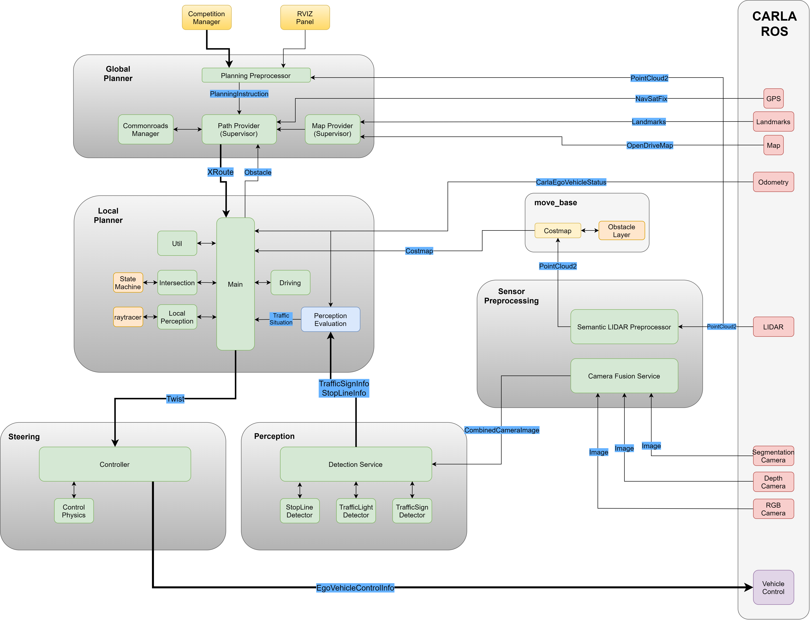

# PSAF WS20/21 Gruppe 1
Das Simulieren von autonomen Fahrzeugen ist ein wichtiger Bestandteil des Entwicklungsprozesses von autonomen Fahrzeugen. 
Durch Simulation kann ein System getestet und Funktionen validiert sowie verifiziert werden.  
Dies ermöglicht Fehlererkennung, Fehlerlokalisierung und Fehleridentifizierung, sodass eine Optimierung des Systems erleichtert wird. 
  
In diesem Projekt soll ein autonomes Fahrzeug in ROS konzeptioniert und implementiert werden, welches mithilfe des CARLA Simulators getestet werden kann.

## Inhalt
  * [Inhalt](#inhalt)
  * [Aufgabenstellung](#aufgabenstellung)
  * [Übersicht der Ergebnisse](#%C3%9Cbersicht-der-ergebnisse)
    + [Abhängigkeiten zwischen Modulen](#abh%c3%a4ngigkeiten-zwischen-modulen)
    + [Enthaltene Pakete](#enthaltene-pakete)
      - [Abstraction Layer](#abstraction-layer)
      - [Global Planner](#global-planner)
      - [Local Planner](#local-planner)
      - [Sensor Preprocessing](#sensor-preprocessing)
      - [Perception](#perception)
      - [Steering](#steering)
      - [Starter](#starter)
      - [Obstacle Layer](#obstacle-layer)
      - [Scenario](#scenario)
      - [Optimizer](#optimizer)
      - [Messages](#messages)
  * [Setup des Projektes](#setup-des-projektes)
    + [Setup ROS Noetic und CARLA 0.9.10](#setup-ros-noetic-und-carla-0910)
    + [Setup des PSAF1 Projekts](#setup-des-psaf1-projekts)
      - [PSAF Machine Learning Modelle](#psaf-machine-learning-modelle)
      - [Installation von Abhängigkeiten](#installation-von-abhängigkeiten)
  * [Ausführung des PSAF1 Projekts](#ausf%C3%BChrung-des-psaf1-projekts)
  * [Hinweise & häufige Fehler](#hinweise--häufige-fehler)
  * [Fazit](#fazit)


## Aufgabenstellung
Dieses Repository ist das Ergebnis der Veranstaltung *„Praktikum: Simulation für autonome Fahrzeuge“* des Lehrstuhls für Mechatronik an der Universität Augsburg. 
Im Rahmen der Veranstaltung soll mithilfe der Simulationsumgebung [CARLA](http://carla.org/) ein autonomes Fahrzeug entwickelt werden. 

Die Aufgabe umfasst folgende Punkte:
1. Das Fahrzeug soll in ROS implementiert werden. Die [CARLA ROS Bridge](https://github.com/carla-simulator/ros-bridge) dient hierbei als Schnittstelle zwischen CARLA und ROS.
2. Das Fahrzeug soll selbstständig eine Route berechnen können.
3. Das Fahrzeug muss selbständig vom Startpunkt zum Zielpunkt gelangen.
4. Das Fahrzeug muss Ampeln, STOP-Schilder und Geschwindigkeitsbegrenzungsschilder erkennen und darauf entsprechend reagieren können.
5. Das Fahrzeug befindet sich in einer Welt mit anderen Verkehrsteilnehmern (nur PKW).
6. Folgende CARLA Maps müssen unterstützt werden: Town 01, 02, 03 und 05
7. Als Farzeugmodell ist das Tesla Model 3 zu wählen
8. Eine Fahrt soll über den vorgegebenen [Comeptition Manager](https://github.com/ll7/psaf20/tree/main/psaf20_competition_manager) gestartet werden können.

## Übersicht der Ergebnisse


### Abhängigkeiten zwischen Modulen


### Enthaltene Pakete

#### [Abstraction Layer](psaf_ros/psaf_abstraction_layer)
Dieses Paket stellt eine Abstraktionsschicht zu den Sensoren des Fahrzeugs dar. Für Sensoren wie das GPS-Modul oder die Semantic Camera wird von diesem Paket eine Klassenrepräsentation angeboten, die von anderen Modulen eingebunden werden kann.
 
Genauere Informationen sind dem Readme [Abstraction Layer](psaf_ros/psaf_abstraction_layer) zu entnehmen.

#### [Global Planner](psaf_ros/psaf_global_planner)
Die Hauptaufgabe des Global Planner besteht darin, einen Pfad vom der aktuellen Position zu einem Zielpunkt zu planen. Um dies zu bewerkstelligen, müssen entsprechende Karteninformationen generiert, bzw. konvertiert und aufbereitet werden. Neben einer einfachen Abfolge von Wegpunkten enthält der Plan auch Informationen wie Geschwindigkeitsbeschränkungen oder Stoppschilder.
Nach der initialen Planung steht der Planner bereit, um im Falle von Hindernissen dynamisch neu zu planen.
 
Genauere Informationen sind dem Readme [Global Planner](psaf_ros/psaf_global_planner) zu entnehmen.

#### [Local Planner](psaf_ros/psaf_local_planner)
Die Hauptaufgabe des Local Planner ist das Berechnen einer Geschwindigkeits- und einer Lenkwinkelvorgabe für das Fahrzeug. Hierbei werden Informationen aus dem 
[Global Planner](psaf_ros/psaf_global_planner) (Globaler Pfad, Geschwindigkeit auf Streckenabschnitten) oder der [Perception](psaf_ros/psaf_perception) (Ampeln, Stoppschilder) verwendet. Dadurch kann der Local Planner dem
globalem Pfad zum Ziel folgen und dabei Verkehrsregeln beachten. Zudem werden andere Fahrzeuge in der näheren Umgebung des eigenen Fahrzeugs auch in die Planung einbezogen.
Falls im Pfad Hindernisse wie langsamere Verkehrsteilnehmer auftreten, kann der Local Planner eine Neuplanung beim Global Planner auslösen.
 
Genauere Informationen sind dem Readme [Local Planner](psaf_ros/psaf_local_planner) zu entnehmen. 

#### [Sensor Preprocessing](psaf_ros/psaf_sensor_preprocessing)
Dieses Paket kombiniert einerseits Bild-Daten der RGB-, der Tiefen- und der Segmentation-Kamera zu einem gesammelten Bild und stellt dies der Perception zur Verfügung.
Anderseits werden hier Informationen eines LIDAR-Sensors auf bestimmte Hindernisse untersucht und vorab aufbereitet. Diese Informationen werden beispielsweise vom Local Planner verwendet.

Genauere Informationen sind dem Readme [Sensor Preprocessing](psaf_ros/psaf_sensor_preprocessing) zu entnehmen. 

#### [Perception](psaf_ros/psaf_perception)
Das Paket Perception ermöglicht es, Ampeln und ihren Zustand sowie Haltelinien zu erkennen. Hierzu werden kombinierte Kamerainformationen aus dem Paket [Sensor Preprocessing](psaf_ros/psaf_sensor_preprocessing) verwendet. Um mit diesen Informationen Objekte zu Detektieren kommt das System [YOLO v3](https://pjreddie.com/darknet/yolo/) zum Einsatz.
 
Genauere Informationen sind dem Readme [Perception](psaf_ros/psaf_perception) zu entnehmen. 

#### [Steering](psaf_ros/psaf_steering)
Dieses Paket ist für die kontrollierte Steuerung des Fahrzeuges zuständig. Es erhält hierzu vom [Local Planner](psaf_ros/psaf_local_planner) Geschwindigkeits- und einer Lenkwinkelvorgaben, die über
einen Regler eingestellt und als Kontrollbefehle an das Fahrzeug weitergegeben werden.
 
Genauere Informationen sind dem Readme [Steering](psaf_ros/psaf_steering) zu entnehmen. 

#### [Starter](psaf_ros/psaf_starter)
Dieses Paket ermöglicht das komfortable Starten unseres Projektes. Dafür stehen launch-Dateien zur Verfügung, die eine Fahrt mit oder ohne Verkehrsregeln ermöglichen.
 
Genauere Informationen sind dem Readme [Starter](psaf_ros/psaf_starter) zu entnehmen. 

#### [Obstacle Layer](psaf_ros/psaf_obstacle_layer)
Das Paket Obstacle Layer leert regelmäßig, die von *move_base* erstellte Costmap. Dadurch kann die Costmap wieder neu befüllt werden.
 
Genauere Informationen sind dem Readme [Obstacle Layer](psaf_ros/psaf_obstacle_layer) zu entnehmen. 


#### [Scenario](psaf_ros/psaf_scenario)
Dieses Paket dient nur als Hilfe für die Entwicklung des Projekts. Es ermöglicht, den aktuellen Stand der Entwlicklung in einem Szenario zu testen und zu Bewerten.
Ein Szenario enthält dabei eine bestimmte Route, die das Fahrzeug abfahren soll. Als Ergebnis wird eine Bewertung bereitgestellt, die angibt wie gut dem Weg gefolgt wurde.
 
Genauere Informationen sind dem Readme [Scenario](psaf_ros/psaf_scenario) zu entnehmen. 

#### [Optimizer](psaf_ros/psaf_optimizero)
Auch dieses Paket dient als Hilfe für die Entwicklung des Projekts. Der Optimizer kann dazu verwendet werden, verschiedene Parameter der vorhandenen Implementierung zu optimieren. Hierzu werden mithilfe des [Scenario Runner](psaf_ros/psaf_scenario) verschiedene Parametrierungen evaluiert und so ein Optimum gefunden.
 
Genauere Informationen sind dem Readme [Optimizer](psaf_ros/psaf_optimizero) zu entnehmen. 

#### [Messages](psaf_ros/psaf_messages)
Dieses Paket definiert eigene neu definierte Nachrichtentypen, die von den anderen Paketen verwendet werden.


## Setup des Projektes

### Setup ROS Noetic und CARLA 0.9.10
Zunächst wird ROS Noetic installiert:
``` bash
# ros noetic
# http://wiki.ros.org/noetic/Installation/Ubuntu
sudo sh -c 'echo "deb http://packages.ros.org/ros/ubuntu $(lsb_release -sc) main" > /etc/apt/sources.list.d/ros-latest.list'
sudo apt-key adv --keyserver 'hkp://keyserver.ubuntu.com:80' --recv-key C1CF6E31E6BADE8868B172B4F42ED6FBAB17C654
sudo apt update
sudo apt install ros-noetic-desktop-full
echo "source /opt/ros/noetic/setup.bash" >> ~/.bashrc
source ~/.bashrc
```
 
Anschließend kann CARLA 0.9.10 heruntergeladen und installiert werden:
``` bash
# carla0.9.10.1
cd ~/Downloads
wget https://carla-releases.s3.eu-west-3.amazonaws.com/Linux/CARLA_0.9.10.1.tar.gz
mkdir -p ~/carla0.9.10.1
tar -xf CARLA_0.9.10.1.tar.gz -C ~/carla0.9.10.1 # extract
echo "export PYTHONPATH=$PYTHONPATH:~/carla0.9.10.1/PythonAPI/carla/dist/carla-0.9.10-py3.7-linux-x86_64.egg" >> ~/.bashrc
sudo apt install python3-pip
pip3 install --user pygame numpy
```
 
Zuletzt wird die Carla ROS Bridge installiert und eingerichtet:
``` bash
# git
sudo apt install git

# python link
sudo ln -s /usr/bin/python3 /usr/bin/python

# carla-ros-bridge
mkdir -p ~/carla-ros-bridge/catkin_ws/src
cd ~/carla-ros-bridge
git clone https://github.com/carla-simulator/ros-bridge.git
cd ros-bridge
git submodule update --init

# Select correct version matching carla version
git checkout 0.9.10.1

cd ../catkin_ws/src
ln -s ../../ros-bridge
echo "source /opt/ros/noetic/setup.bash" >> ~/.bashrc
source ~/.bashrc
cd ..

sudo apt install python3-rosdep2
rosdep update
rosdep install --from-paths src --ignore-src -r

catkin_make
```

### Setup des PSAF1 Projekts
Das PSAF1 Projekt wird geklont und eingerichtet:
``` bash
# setup project
cd ~/
git clone https://github.com/ll7/psaf1.git
ln -s ~/psaf1/psaf_ros/ ~/carla-ros-bridge/catkin_ws/src/
```

#### PSAF Machine Learning Modelle
Damit die Objekterkennung des [Perception](psaf_ros/psaf_perception)-Pakets funktioniert, müssen noch [Modelldaten]((https://git.rz.uni-augsburg.de/luttkule/carla-praktikum-ws2019/-/blob/master/carla_object_recognition/yolo-obj_last.weights)) heruntergeladen werden und nach **psaf1/psaf_ros/psaf_perception/models/** kopiert werden.

#### Installation von Abhängigkeiten
Für den Betrieb des Projekts sind einige apt-Pakete notwendig:
``` bash
sudo apt-get install ros-noetic-move-base ros-noetic-teb-local-planner ros-noetic-costmap-converter ros-noetic-map-server ros-noetic-lanelet2 ros-noetic-cv-bridge ros-noetic-mrt-cmake-modules ros-noetic-navigation ros-noetic-derived-object-msgs
```
 
Zudem werden noch folgende Python Module benötigt:
``` bash
pip3 install simple-pid seaborn tqdm pandas pyyaml

cd ~/psaf1/psaf_ros/psaf_planning/external/
pip3 install -r requirements.txt
```

Ebenso muss pytorch entsprechen der Anleitung auf (Pytorch.org)[https://pytorch.org/] installiert werden. Dabei ist auf die lokal verwendete Treiberversion zu achten.
Für eine optimale Nutzung wird eine Nvidia-Grafikarte in Verbindung mit dem ensprechenden Cuda-Treiber benötigt. Die Anforderungen an die Grafikkarte sind im Modul  [Perception](psaf_ros/psaf_perception) näher beschrieben.

## Bauen des PSAF1 Projekts

Vor der Ausführung muss der Source-Code kompiliert werden.
``` bash
cd ~/carla-ros-bridge/catkin_ws
catkin_make
echo "source ~/carla-ros-bridge/catkin_ws/devel/setup.bash" >> ~/.bashrc
source ~/.bashrc
```

## Ausführung des PSAF1 Projekts
Vor der Ausführung des Projekts muss zunächst der CARLA-Server gestartet werden. Dies lässt sich im CARLA Ordner mit dem Skript **CarlaUE4.sh** bewerkstelligen.
``` bash
cd ~/carla0.9.10.1
./CarlaUE4.sh -carla-server -windowed -ResX=320 -ResY=240 -benchmark -fps 20 -opengl
```

Anschließend kann das Projekt in einem neuen Terminal gestartet werden. Hierfür muss entschieden werden, ob die Fahrt mit oder ohne Verkehrsregeln 
erfolgen soll. Genaueres zu den verfügbaren launch-Dateien ist [psaf_starter](psaf_ros/psaf_starter/) zu entnehmen.

``` bash
# mit Verkehrsregeln
roslaunch psaf_starter start_autonomous_driving_with_traffic_rules.launch

# ohne Verkehrsregeln
roslaunch psaf_starter start_autonomous_driving_without_traffic_rules.launch
```

Nun wird ein Fahrzeug in der CARLA-Simulation gespawn und es öffnet sich ein RVIZ Fenster, mit der Zustand des Fahrzeuges überwacht werden kann.
Sobald in RVIZ im Abschnitt **GoalPanel** der Status *'Init Done'* angezeigt wird, kann eine Zielkoordinate eingegeben werden und die Fahrt gestartet werden. 


Alternativ kann eine Fahrt auch über den Competition Manager gestartet werden. Sobald der Wettbewerb mit dem set_position_client gestartet wird, 
wird das Fahrzeug an die vorgegebene Startposition gesetzt und startet eine Fahrt zu gegebenen Zielposition.
 
Andere Verkehrsteilnehmer können mit folgendem Befehl in der Welt plaziert werden:
``` bash
cd ~/carla_0.9.10.1/PythonAPI/examples
python3 spawn_npc.py -n 200 -w 0
```

## Hinweise & häufige Fehler

1. Vor dem Starten der Planung muss gewartet werden, bis im RVIZ **GoalPanel** der Status *'Init Done'* angezeigt wird.
2. Für die Fahrt mit Verkehrsregeln wird eine sehr starke GPU und CPU empfohlen. Die Anforderungen an die Grafikkarte sind im Modul  [Perception](psaf_ros/psaf_perception) näher beschrieben. Wird die Option 'use_gpu=False' genutzt, kann die Berechnung zu langsam sein und das Fahrzeug bremst zu spät.
3. Falls die Verwendete Hardware nicht ausreichend ist oder zu viele Verkehrsteilnehmer gespawnt wurden, kann es vorkommen, dass die Simulation
*'Out-Of-Sync'*-Läuft. Dabei wird das autonome Fahrzeug nicht mehr zuverlässig mit der Simulation aktualisiert und kann daher nicht mehr korrekt auf die Umgebung reagieren.
4. Auf der CARLA-Karte *Town 05* kommt es in der Umgebung der Koordinaten (38,-171) zu Problemen. An dieser Stelle läuft die Simulation selbst mit sehr wenigen NPCs und guter Hardware *'Out-Of-Sync'*.
5. Gelegentlich tritt ein Fehler beim Start von RVIZ auf. Dieser Fehler steht nicht im Zusammenhang mit dem entwickelten System, sondern tritt auch bei anderer Nutzung der Carla-Ros-Bridge auf. Ein Neustart des Befehls behebt den Fehler.

## Fazit
Abschließend lässt sich sagen, dass das im Laufe des Projekts entwickelte Fahrzeug alle Anforderungen der 
Aufgabenstellung erfüllt. 
  
Obwohl das Themengebiet "autonomes Fahren" sehr weitreichend ist, hat es das Praktikum *Simulation von autonomen Fahrzeugen* ermöglicht, 
teils tiefgreifendes Wissen zu bestimmten Bereichen des Themengebiets zu erwerben.  
Durch die im Projekt erlangte 'Hands-On'-Erfahrung fällt es den Teilnemern sicherlich leichter zukünftige Projekte
im Bereich autonomes Fahren oder auch ROS zu meistern.


