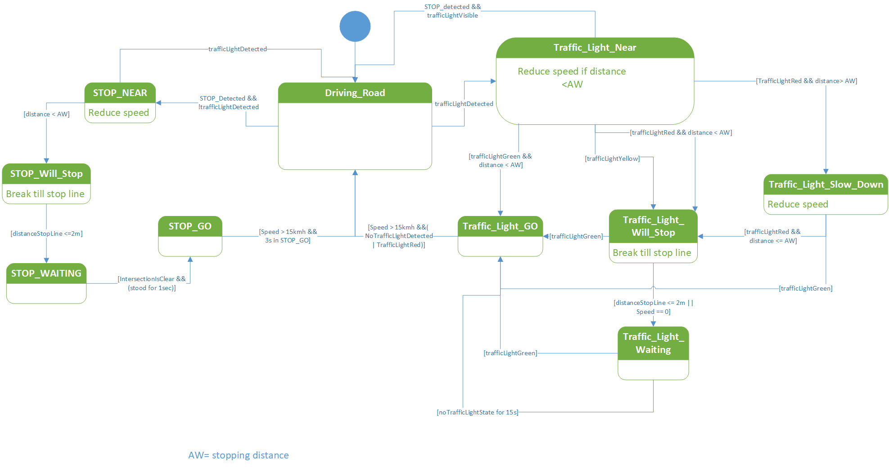
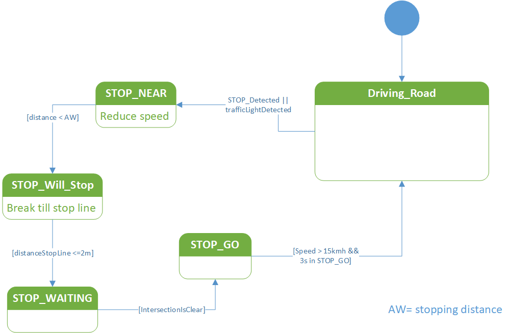

# psaf_local_planner

## Inhalt
* [Inhalt](#inhalt)
* [Übersicht](#bersicht)
    * [Kurzbeschreibung](#kurzbeschreibung)
    * [Topics](#topics)
    * [Message Struktur](#message-struktur)
* [Funktionalität](#funktionalitt)
    * [Global Plan Verarbeitung](#global-plan-verarbeitung)
    * [Lenkwinkelvorgabe](#lenkwinkelvorgabe)
    * [Kurvengeschwindigkeit](#kurvenmaximalgeschwindigkeit)  
    * [Costmap Raytracer](#costmap-raytracer)
    * [LocalPerception](#localperception)
    * [Überholvorgang](#überholvorgang)
    * [Local Perception Evaluation](#Local-Perception-Evaluation) 
    * [State Machine](#state-machine)

## Übersicht
### Kurzbeschreibung
Die Hauptaufgabe des Local Planner ist das Berechnen einer Geschwindigkeits- und einer Lenkwinkelvorgabe für das Fahrzeug. 
Die Entscheidung zur Festlegung dieser Vorgaben wird dabei anhand der zur Verfügung stehenden Informationen wie beispielsweise der Globalen Route (Geschwindigkeit auf Streckenabschnitten) oder der Perception (Ampeln, Stoppschilder) geschehen. 
Dabei werden andere Fahrzeuge im näheren Umfeld des eigenen Fahrzeugs auch in diese Planung einbezogen. 
Des Weiteren entscheidet der Local Planer auch auf Basis der Informationen, ob eine Neuplanung des GlobalPlanners ausgelöst werden soll.
### Topics
#### Publish
| Topic | Datatype | Module|
| ----------- | ----------- |----------- |
| psaf_global_plan | Path | [Global Plan Verarbeitung](#global-plan-verarbeitung) |
| /psaf/planning/obstacle | [Obstacle](../psaf_messages/msg/Obstacle.msg) |  [LocalPerception](#localperception) |
| /psaf/debug/local_planner/state | String |  [State Machine](#state-machine) |
| /psaf/local_planner/traffic_situation | [TrafficSituation](../psaf_messages/msg/TrafficSituation.msg)|  [Local Perception Evaluation](#Local-Perception-Evaluation) |


#### Subscribe
| Topic | Datatype | Module|
| ----------- | ----------- |----------- |
| /psaf/xroute | [XRoute](../psaf_messages/msg/XRoute.msg) | [Global Plan Verarbeitung](#global-plan-verarbeitung)|
| /psaf/local_planner/traffic_situation | [TrafficSituation](../psaf_messages/msg/TrafficSituation.msg)|  [State Machine](#state-machine) |
### Message Struktur

### Launch Dateien
- *psaf_local_perception_evaluation_service.launch*: Startet den Perception Evaluation Service zur Verarbeitung der Verkehrssituation.


## Funktionalität
Die Funktion des Local Planners lässt sich grundlegend in die vier Grundfunktionen Verarbeitung des GlobalPlans [Global Plan Verarbeitung](#global-plan-verarbeitung), [Berechnung der Lenkwinkelvorgabe](#Lenkwinkelvorgabe), Berechnung der Geschwindigkeitsvorgabe und [Entscheidung zum Replanning](#Local-Perception)  unterteilen.
Die Berechnung der Geschwindigkeitsvorgabe geschieht hierbei in Abhängigkeit folgender Funktionen: 
* [Berechnung anhand des Kurvenradiuses der aktuellen Trajektorie](#Kurvenmaximalgeschwindigkeit)
* [Berechnung anhand des Abstandes zu etwaigen Hindernissen vor dem Fahrzeug](#Local-Perception)
* [Berechnung anhand des Abstandes zu Hindernissen neben dem Fahrzeug bei einem Überholvorgang](#berholvorgang)
* [Berechnung anhand der Verkehrszeichen Situation (Ampeln, Stoppschilder, ....)](#state-machine)


### Global Plan Verarbeitung
###### [Source (.cpp)](src/psaf_local_planner/Main.cpp)  | [Header (.h)](include/psaf_local_planner/plugin_local_planner.h)
Die vom [Global Planner](../psaf_global_planner)  erstellte Global Route ([XRoute](../psaf_messages/msg/XRoute.msg)) wird zur weiteren Verarbeitung im LocalPlaner lokal gespeichert.
Dieser Lokale Plan wird an Spurwechseln durch lineare Interpolation der einzelnen Pfad Punkte so angepasst, dass sich abhängig von der erlaubten Geschwindigkeit ein weicher Spurwechsel ergibt.
Handelt es sich beim gepublishten Globalen Plan um ein Replaning wird mithilfe einer Heuristik entschieden ob die neue Route doppelt so lang wie die aktuelle lokale XRoute ist.
Dies wird abhängig von der Beachtung der Verkehrsregeln anhand der Duration in der XRoute(Beachtung der Verkehrsregeln) oder der Länge der Lanelets (keine Beachtung der Verkehrsregeln) entschieden.
Falls dieser neue Globale PLan zu lang ist, wird weiterhin der alte lokale Plan beibehalten.
Die Verarbeitung gewährleistet weiterhin, dass die lokale Route aktualisiert bleibt, indem bereits überfahrende Teile der lokalen Route gelöscht werden.

### Lenkwinkelvorgabe
###### [Source (.cpp)](src/psaf_local_planner/Driving.cpp)  | [Header (.h)](include/psaf_local_planner/plugin_local_planner.h#L175)

Der Lenkwinkel des Fahrzeugs wird anhand der aktuellen Position des Fahrzeugs sowie einem Punkt auf dem lokalen Pfad. Dieser Punkt wird abhängig von der Geschwindigkeit einige Meter vor dem Fahrzeug gewählt. Ein höherer Abstand sorgt für ein glatteres Fahrverhalten mit weniger Oszillationen, führt jedoch dazu, dass Kurven zu eng genommen bzw. geschnitten werden.

Mit Hilfe des `atan2` wird der Winkel zwischen dem Fahrzeugsvektor sowie dem Vektor vom Fahrzeugsmittelpunkt zum Zielpunkt im Interval [-pi, +pi] berechnet. Dieser Winkel entspricht dem Lenkwinkel des Fahrzeugs.


```
               x  x
         x  x 
       o 
 |   x╱
 │ x ╱ 
 │x ╱
╭─╮╱
│C│
╰─╯
```


### Kurvenmaximalgeschwindigkeit
###### [Source (.cpp)](src/psaf_local_planner/Driving.cpp)  | [Header (.h)](include/psaf_local_planner/plugin_local_planner.h#L190)

Um nicht aus engen Kurven zu fliegen, muss die dort maximal mögliche Geschwindigkeit im Vorraus berechnet werden. Hierfür kann die Haftreibungsformel in Kurven verwendet werden: `v <= sqrt(µ_haft * r * g)`.

Hierfür ist jedoch der Kreisradius der Kurve nötig. Dieser kann mit der [Menger Gleichung](https://en.wikipedia.org/wiki/Menger_curvature#Definition) berechnet werden. Hierfür werden drei Punkte auf der nächsten Kurve gesucht. Der Anfang bzw. das Ende der Kurve wird gefunden durch ein Vorzeichenwechsel zwischen dem Winkel drei aufeinanderfolgenden Punkten.

```
               o x x x x x
          x x
      o x 
    x
  x
 x
o
x
x
x
```


### Costmap Raytracer
###### [Source (.cpp)](src/psaf_local_planner/costmap_raytracer.cpp)  | [Header (.h)](include/psaf_local_planner/costmap_raytracer.h)
Der Costmap Raytracer findet durch Raytracing Hindernisse auf der Costmap innerhalb eines Teilkreises mit definiertem Radius und Winkeln um das Auto herum (vgl. Abb unten).
Durch eine niedrige Schrittweite zwischen den Rays, können einzelne Fahrzeuge teilweise mehrmals getroffen werden. So wird die Position des Hindernisses, der Abstand zum Fahrzeug sowie die Seite des Fahrzeugs, auf der sich das Hinderniss befindet, ermittelt.


```
         │       o┌─┐
   ╲     │      ╱ │A│
    ╲    │     ╱  └─┘o
_    ╲   │    ╱   _╱
 ╲_   ╲  │   ╱  _╱
   ╲_  ╲ │  ╱ _╱
     ╲_ ╭─╮ _╱       ┌─┐
─────── │C│ ────────o│A│
(-)min  ╰─╯  max(+)  └─┘
```

Zur Überprüfung ob z.B. [Stoppkreuzungen](#state-machine) frei sind ist eine zeitliche Abhängigkeit nötig. Durch Abgleichen mit den Messungen zwei vorheriger Iterationen, kann festgestellt werden, ob Bewegungen auf der Costmap auftreten. Werden keine Veränderungen erkannt, wird der Bereich als passierbar freigegeben, um statische Hindernisse ignorieren zu können.

### Local Perception
###### [Source (.cpp)](src/psaf_local_planner/LocalPerception.cpp)  | [Header (.h)](include/psaf_local_planner/plugin_local_planner.h#L223)
Die Local Perception vehindert anhand der Costmap die Kollision mit vorausfahrenden bzw. haltenden Fahrzeugen. Hierfür wird die Distanz vom eigenem Fahrzeug bis zum nächsten Hinderniss gemessen.
So kann mithilfe der Formel für den [Anhalteweg](https://www.bussgeldkatalog.org/anhalteweg/), die nach der Geschwindigkeit umgestellt wird, die nötige Geschwindigkeit herausgefunden werden, die das Fahrzeug ansteuern muss, um einen konstanten Abstand zu halten.

Unterschreitet diese Geschwindigkeit über einen längeren Zeitraum einen bestimmten Schwellenwert, dann wird eine Spurwechsel initiert. Hierfür werden alle durch den [Costmap Raytracer](#Costmap-Raytracer) erkannten Hindernisse in der [Obstacle](../psaf_messages/msg/Obstacle.msg) Message an den Global Planner gesendet. Dadurch wird im [Global Planner](../psaf_global_planner) ein Neuplanen ausgelöst.

### Überholvorgang
###### [Source (.cpp)](src/psaf_local_planner/Driving.cpp)  | [Header (.h)](include/psaf_local_planner/plugin_local_planner.h)
Um beim Überholvorgang keine Kollision mit einem anderen Fahrzeug zu provozieren wird anhand [XtendedLanelet Nachricht](../psaf_messages/msg/XLanelet.msg) überprüft ob innerhalb eines definierbaren Horizontes ein Spurwechsel/Überholvorgang stattfindet.
Ist dies der Fall wird zunächst berechnet ob der Spurwechsel entlang der Fahrtrichtung links oder rechts vom eigenen Fahrzeug erfolgt. Entsprechend wird ein Teilkreis auf der Seite der Vorganges mittels des [Costmap Raytracers](#Costmap-Raytracer) auf Hindernisse überprüft. 
Im Fall dass sich in diesem bereich ein Hinderniss befindet wird die Geschwindigkeitsvorgabe entsprechend des [Anhaltewegs](https://www.bussgeldkatalog.org/anhalteweg/) angepasst.

### Local Perception Evaluation
Das [Perception](../psaf_perception)-Modul sammelt alle Informationen zu allen sichtbaren Verkehrselementen.
Dabei werden z.B. auch Ampeln der kreuzenden Fahrbahn erkannt. Damit die korrekte Ampel ausgewählt wird, werden die erkannten Objekte mit dem aktuellen Fahrzeugzustand (z.B. Lenkwinkel) verknüpft und entsprechend selektiert.
Das Ergebnis wird dann als aktuelle Verkehrssituation an den Zustandsautomaten weitergegeben.

### State Machine
###### [Source (.cpp)](src/psaf_local_planner/StateMachine.cpp)  | [Header (.h)](include/psaf_local_planner/state_machine.h)
Zur Steuerung des Verhaltens unter Beachtung der Verkehrsregeln wird anhand des Wissens über die aktuelle Verkehrssituation der Zustand eines Zustandsautomates aktualisiert. 
Dazu werden die Kartendaten des globalen Plans und die Daten der *Perception* genutzt.
Grundsätzlich wird zwischen drei Szenarien unterschieden: 
- Das Auto fährt regulär auf der Straße: **Driving**
- Das Auto kommt an eine Kreuzung mit einer Ampel: **Traffic_Light_***
- Das Auto kommt an eine Kreuzung mit einer Stopp-Regelung: **STOP_*** 



Im Falle des Fahrens ohne Verkehrsregeln werden Ampeln so behandelt als seien es reguläre Kreuzungen mit Stopp-Regelung.
Somit ist der Automat nahezu identisch, nur werden die Ampelzustände nicht mehr betrachtet.



Das Verhalten in den jeweiligen Zuständen lässt sich wie folgt vereinfacht beschreiben:
- **Driving**: Fahre mit der aktuell maximal erlaubten Geschwindigkeit
- **Traffic_Light_Near**: Prüfe die Ampelphase
- **Traffic_Light_Go**: Das Auto hat Vorfahrt und die Kreuzung kann mit der maximal erlaubten Geschwindigkeit überquert werden 
- **Traffic_Light_Will_Stop**: Die Entfernung zur Kreuzung ist geringer als der Anhalteweg (zzg. extra Reaktionszeit) und 
  die Geschwindigkeit wird zu reduziert, dass das Fahrzeug an der Haltelinie zum Stehen kommt.
- **Traffic_Light_Slow_Down**: Bei der Annäherung an eine rote Ampel wird die Geschwindigkeit etwas reduziert (50%).
- **Traffic_Light_Waiting**: Die Zielgeschwindigkeit wird auf 0 gesetzt, sodass das Auto an der Haltelinie wartet.
- **STOP_NEAR**: Bei der Annäherung an eine Stopp-Kreuzung wird die Geschwindigkeit etwas reduziert (50%).
- **STOP_Will_Stop**: Die Entfernung zur Kreuzung ist geringer als der Anhalteweg (zzg. extra Reaktionszeit) und 
  die Geschwindigkeit wird zu reduziert, dass das Fahrzeug an der Haltelinie zum Stehen kommt.
- **STOP_Waiting**: Die Zielgeschwindigkeit wird auf 0 gesetzt, sodass das Auto an der Haltelinie wartet bis der Kreuzungsbereich frei ist.
- **STOP_GO**: Das Auto hat Vorfahrt und die Kreuzung kann mit der maximal erlaubten Geschwindigkeit überquert werden
