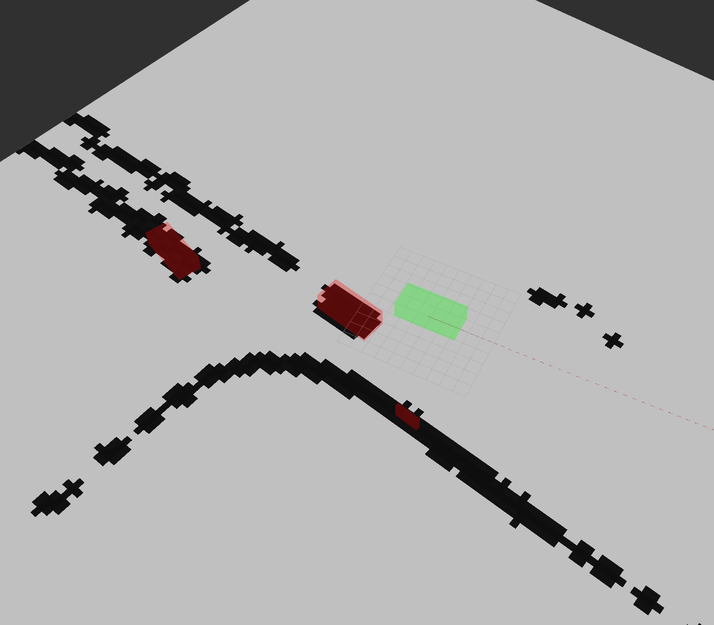

# psaf_obstacle_layer
## Inhalt

* [Inhalt](#inhalt)
* [Übersicht](#kurzbeschreibung)
* [Problem](#problem)
* [Lösung](#lösung)

##  Kurzbeschreibung
Der PsafObstacleLayer ist eine Erweiterung des [Obstacle Layers](https://docs.ros.org/en/noetic/api/costmap_2d/html/classcostmap__2d_1_1ObstacleLayer.html) der [costmap_2d](https://wiki.ros.org/costmap_2d) Library. Diese wird verwendet von [move_base](https://wiki.ros.org/move_base) zum erstellen der Costmap verwendet. Durch die Verwendung dieses ObstacleLayers wird die vollständige Costmap nach jeder Iteration komplett geleert.

## Problem
Leider wird die Costmap nur spärlich gecleared, trotz dem Parameter `observation_persistence: 0.1` für die Lidar Sensoren. Dies sorgt für Artefakte, die die Fahrzeuge hinter sich her ziehen. Dadurch kann die Position der Fahrzeuge nicht zuverlässig erkannt werden.

## Lösung
Durch überschreiben von `PsafObstacleLayer::updateCosts` kann beeinflusst werden, was jede Iteration ausgeführt wird. Hier kann durch Ausführen von `ObstacleLayer::reset()` die Costmap geleert werden.
Durch die hohe Auflösung der Lidar Sensoren kann die Costmap jede Iteration neu erstellt werden, wobei nur die tatsächliche Hülle der Fahrzeuge erkannt wird.
