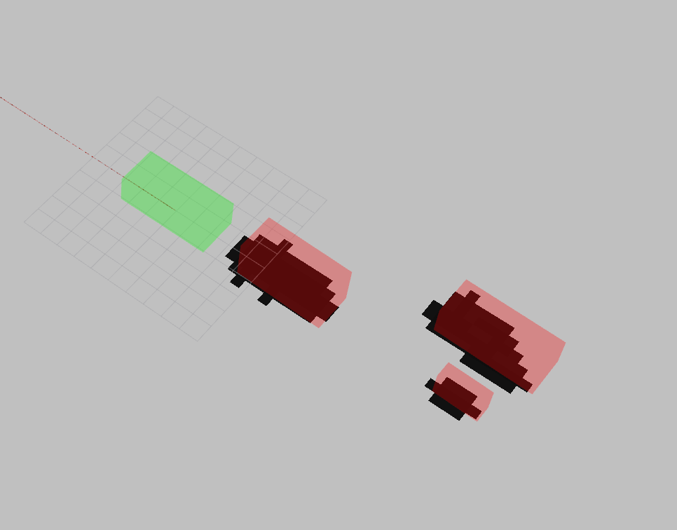

# psaf_obstacle_layer
## Inhalt

* [Inhalt](#inhalt)
* [Kurzbeschreibung](#kurzbeschreibung)
* [Artefaktverhinderung](#Artefaktverhinderung)

##  Kurzbeschreibung
Der PsafObstacleLayer ist eine Erweiterung des [Obstacle Layers](https://docs.ros.org/en/noetic/api/costmap_2d/html/classcostmap__2d_1_1ObstacleLayer.html) der [costmap_2d](https://wiki.ros.org/costmap_2d) Library. Diese wird von [move_base](https://wiki.ros.org/move_base) zum Erstellen der Costmap verwendet. Durch die Verwendung dieses ObstacleLayers wird die vollständige Costmap nach jeder Iteration komplett geleert.

## Artefaktverhinderung
Durch Überschreiben von `PsafObstacleLayer::updateCosts` kann beeinflusst werden, was jede Iteration ausgeführt wird. Hier kann durch Ausführen von `ObstacleLayer::reset()` die Costmap geleert werden.
Durch die hohe Auflösung der Lidar Sensoren kann die Costmap jede Iteration neu erstellt werden, wobei nur die tatsächliche Hülle der Fahrzeuge erkannt wird.

Dies verhindert Artekfakte, die trotz des Parameters `observation_persistence: 0.1` auftreten. Aufgrund dieser Artefakte könnte die Position der Fahrzeuge nicht zuverlässig erkannt werden.
