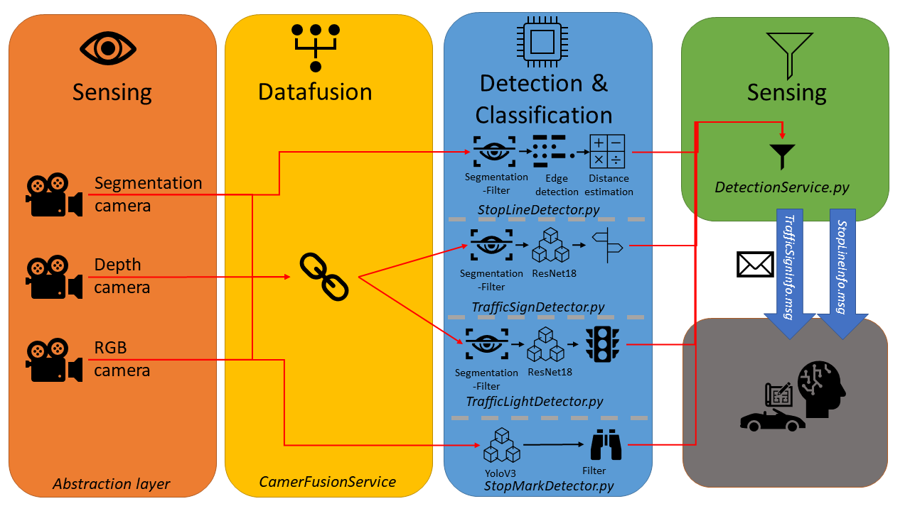
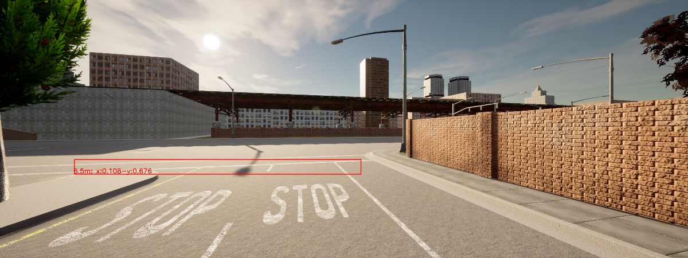
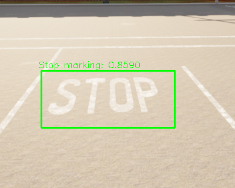
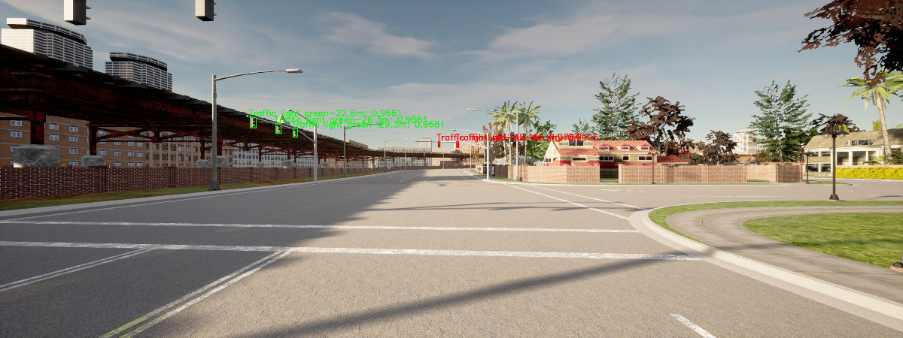
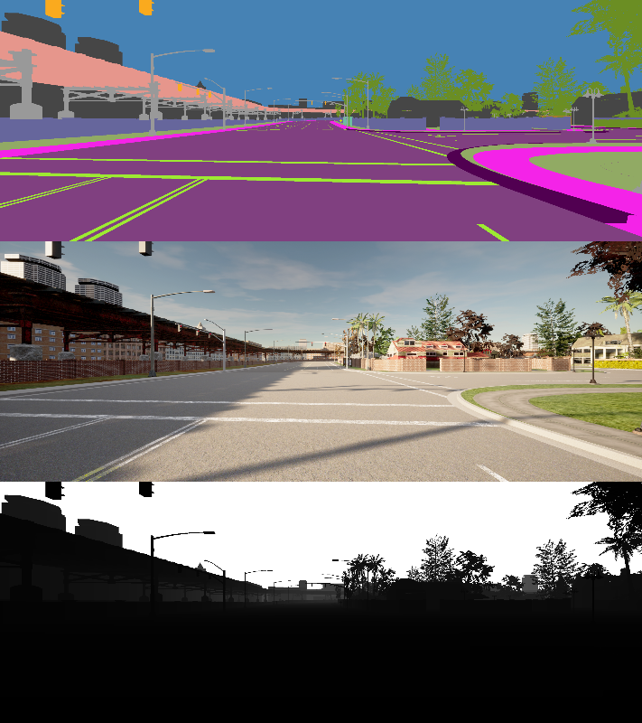
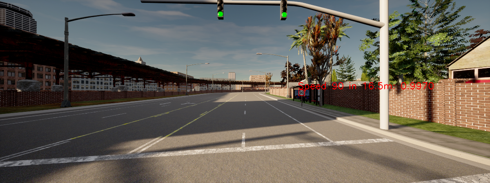

# psaf_perception

## Inhalt
* [Inhalt](#inhalt)
* [Übersicht](#Übersicht)
  * [Beschreibung](#Beschreibung)
  * [Topics](#Topics)
* [Funktionalität](#funktionalität)
  * [Detection Service](#Detection-Service)
  * [Stop Line Detector](#Stop-Line-Detector)
  * [Stop Mark Detector](#Stop-Mark-Detector)
  * [Traffic Light Detector](#Traffic-Light-Detector)
  * [Traffic Sign Detector](#Traffic-Sign-Detector)
  * [Training der neuronalen Klassifikationsnetze](#Training-der-neuronalen-Klassifikationsnetze)

## Übersicht
### Beschreibung
Die Aufgabe der *Perception* ist es anhand der Sensoren (vorrangig Kameras) Informationen zu Umwelt zu sammeln.

  
### Topics
#### Publish
| Topic | Datatype | Module|
| ----------- | ----------- |----------- |
| /psaf/perception/traffic_signs | [TrafficSignInfo](../psaf_messages/msg/TrafficSignInfo.msg) | [DetectionService](src/psaf_perception/DetectionService.py) |
| /psaf/perception/stop_lines | [StopLineInfo](../psaf_messages/msg/StopLineInfo.msg) | [DetectionService](src/psaf_perception/DetectionService.py) |

#### Subscribe
Die nachfolgenden Topics werden über die Abstraktionsschicht indirekt genutzt.

| Topic | Datatype | Module|
| ----------- | ----------- |----------- |
| /carla/{role_name}/camera/rgb/{id}/image_color | Image | RGBCamera |
| /carla/{role_name}/camera/depth/{id}/image_depth | Image | DepthCamera |
| /carla/{role_name}/camera/semantic_segmentation/{id}/image_segmentation | Image | SegmentationCamera |
| /psaf/sensors/{role_name}/fusionCamera/{camera_name}/fusion_image | [CombinedCameraImage](../psaf_messages/msg/CombinedCameraImage.msg) | FusionCamera |

### Launch Dateien
- *psaf_perception_detection_service.launch*: Startet den Detection service
  - Parameter
    - *use_gpu*: Soll die GPU für die Verarbeitung der Klassifizierung genutzt werden. Dies setzt ausreichend Grafikspeicher voraus.
    - *role_name*: Der Rollenname des Carla-Fahrzeugs um auf die Kameras zuzugreifen.
    - *activate_traffic_light_detector*: Ob der Detektor für die Ampeln aktiviert werden soll. 
  - Anforderungen:
    - Der PC sollte über eine Grafikkarte mit mindestens 5,5 GB Grafikspeicher und Cuda-Support verfügen.
    - Modell mit mindestens der Leistungsfähigkeit einer Nvidia RTX 2080, empfohlen wird eine RTX 3070  

## Funktionalität
### Detection Service
Der *Detection Service* startet die entsprechenden Detektoren und sammelt die gewonnen Wahrnehmungsdaten.
Dabei konvertiert es die abstrakten detektieren Objekten anhand ihres Labels in das passende Nachrichtenformat.

Derzeit werden folgende Detektoren gestartet:
- StopLineDetector
- TrafficLightDetector

Sollen alle verfügbaren Detektoren ausgeführt werden, werden mindestens 7.8 GB Grafikspeicher benötigt.

### Stop Line Detector
Die Aufgabe des Detektors ist die Erkennung der Stopp-Linien und die entsprechenden Entfernungen.
#### Ziel
Um an den richtigen Stellen bei Ampeln und Kreuzungen zum Stehen zu kommen, benötigt das Fahrzeug die Entfernung zur Haltelinie.
Dabei sollen jedoch andere Markierungen auf der Straße nicht beachtetet werden.

#### Umsetzung
Anhand der Bilder der Segmentation-Kamera werden die Markierungen der Straße gefiltert. 
Das gefilterte Bild wird daraufhin mittels eines Kantenfilters (Canny) auf Kanten untersucht.
Ein probalistischer Hough Line Detektor ermittelt auf Basis der erkannten Kanten Linie ([siehe OpenCv](https://opencv-python-tutroals.readthedocs.io/en/latest/py_tutorials/py_imgproc/py_houghlines/py_houghlines.html)).
Dann werden die gesammelten Linien anhand ihres Winkels und der Abmessungen gefiltert. 
Anhand einer empirisch ermittelten Funktion werden die y-Koordinaten in Bezug zum Bild in eine Abstandsschätzung umgewandelt.

### Stop Mark Detector
Unter Wiederverwendung des YOLO v3 Modells der Gruppe vom Wintersemester 2019 wurde eine Detektion anhand der RGB Bilder 
umgesetzt.
#### Ziel
Um Kreuzung mit einer Stopp-Regelung zu erkennen, müssen die Beschriftungen am Boden mit "Stop" erkannt werden.

#### Umsetzung
Das trainierte Netz wird in PyTorch geladen und die nicht benötigten Klassen werden ignoriert.
Das Modell kann unter dem [Gitlab-Server](https://git.rz.uni-augsburg.de/luttkule/carla-praktikum-ws2019/-/blob/master/carla_object_recognition/yolo-obj_last.weights) der Universität heruntergeladen werden.
Dies muss händisch geschehen.

### Traffic Light Detector
Die Aufgabe des Detektors ist die Erkennung der Ampel und ihres aktuellen Zustands. Zudem wird die Entfernung mittels der Tiefen-Kamera gemessen.

#### Ziel
Damit sich das Fahrzeug an den Kreuzungen mit einer Ampel korrekt verhält, müssen die Zustände der Ampeln bekannt sein.

#### Umsetzung

Das Bild der FusionCamera, also der Vereinigung der drei Kamera-Bilder von RGB-, Tiefen und Segmentation-Kamera, wird zunächst zu Erkennung der Ampeln genutzt.
Auf Basis des Segmentation-Bildes werden die Objekte im Bild, welche als Ampeln markiert sind, mit *Bounding Boxes* beschrieben.

Daraufhin wird der entsprechende Ausschnitt des RGB-Bildes durch ein Klassifikationsnetzes (Resnet18) klassifiziert.
Das entsprechende Modell ist im Ordner *models* unter "traffic-light-classifiers-*.pt" zu finden.

Dabei stehen folgende Klassen zur Wahl:
- **Red**: Die Ampel zeigt rot
- **Green**: Die Ampel zeigt grün
- **Yellow**: Die Ampel zeigt gelb
- **Back**: Die Rückseite der Ampel ist zu sehen.

Als Ergebnis der Klassifizierung erhält man die wahrscheinlichste Klasse und das Vertrauen des Modells in das Ergebnis.

Anschließend wird für jede Bounding Box, welche nicht als *Back* klassifiziert wurde, anhand der Segmentierungsdaten eine Maske erstellt.
Diese Maske wird genutzt die richtigen Pixel des Tiefenbildes zu wählen.
Über eine Mittelwertsberechnung wird dann anhand der Pixel die Entfernung zur Ampel bestimmt.

### Traffic Sign Detector
Die Aufgabe des Detektors ist die Erkennung der Schilder und deren Entsprechung. Zudem wird die Entfernung mittels der Tiefen-Kamera gemessen.

#### Ziel
Damit sich das Fahrzeug an den Kreuzungen mit einer Ampel korrekt verhält, müssen die Zustände der Ampeln bekannt sein.

#### Umsetzung
Das Bild der FusionCamera ([siehe Traffic Light Detector](#Traffic-Light-Detector)) wird zunächst zu Erkennung der Schilder genutzt.
Auf Basis des Segmentation-Bildes werden die Objekte im Bild, welche als Verkehrsschilder markiert sind, mit *Bounding Boxes* beschrieben.

Daraufhin wird der entsprechende Ausschnitt des RGB-Bildes durch ein Klassifikationsnetzes (Resnet18) klassifiziert.
Das entsprechende Modell ist im Ordner *models* unter "traffic_sign-classifier-*.pt" zu finden.

Dabei stehen folgende Klassen zur Wahl:
- **back**: Die Rückseite eines Schilder
- **speed_30**: Ein europäisches Geschwindigkeitsbeschränkungsschild auf 30 km/h
- **speed_60**: Ein europäisches Geschwindigkeitsbeschränkungsschild auf 60 km/h
- **speed_90**: Ein europäisches Geschwindigkeitsbeschränkungsschild auf 90 km/h
- **speed_limit_30**: Ein amerikanisches Geschwindigkeitsbeschränkungsschild auf 30mp/h
- **speed_limit_40**: Ein amerikanisches Geschwindigkeitsbeschränkungsschild auf 40mp/h
- **speed_limit_60**: Ein amerikanisches Geschwindigkeitsbeschränkungsschild auf 60mp/h
- **stop**: Ein Stopp-Schild

Als Ergebnis der Klassifizierung erhält man die wahrscheinlichste Klasse und das Vertrauen des Modells in das Ergebnis.

Anschließend wird für jede Bounding Box, welche nicht als *Back* klassifiziert wurde, anhand der Segmentierungsdaten eine Maske erstellt.
Diese Maske wird genutzt die richtigen Pixel des Tiefenbildes zu wählen.
Über eine Mittelwertsberechnung wird dann anhand der Pixel die Entfernung zur Ampel bestimmt.

### Training der neuronalen Klassifikationsnetze

Wie bereits erwähnt wurden die Klassifikationsnetze für die Ampel- und Schildererkennung auf Basis des Resnet-18 Models trainiert.
Die entsprechenden Trainingsdaten liegen im Ordner *"training_data"* bei. 
Mithilfe der Skripte im *"util"*-Ordner können weitere Modelle trainiert werden.
Die zum Training verwendeten Parameter und die erreichte Präzision sind bei jedem resultierenden Modell in der gleichnamigen Konfigurationsdatei hinterlegt.

Die derzeit verwenden Modelle kommen jeweils auf eine Präzision von über 97 %.