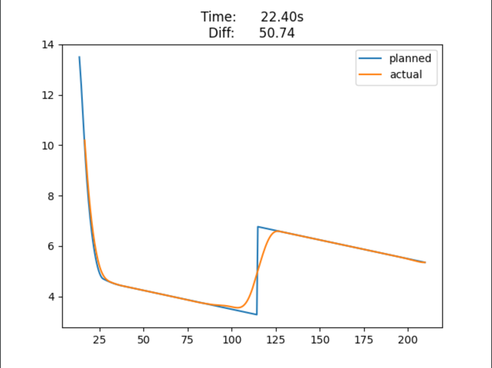

# psaf_scenario

## Inhalt

* [Inhalt](#inhalt)
* [Übersicht](#bersicht)
    * [Kurzbeschreibung](#kurzbeschreibung)
    * [Topics](#topics)
    * [Launch Files](#launch-files)
* [Funktionalität](#funktionalitt)
    * [Scenario Runner](#psaf_scenario)

## Übersicht

### Kurzbeschreibung
Die Hauptaufgabe des Scenario Package ist die der Ausführung und der Bewertung von Szenarien. Die Basis für das Szenario 
bildet eine debugpath Datei, in welcher eine Route definiert ist. 
Als Ergebnis wird eine Bewertung bereitgestellt, die angibt wie gut dem Weg gefolgt wurde. Zur Bewertung wird die 
angegebene Route abgefahren und die Position des Fahrzeugs, sowie die Laufzeit wird mitgeschrieben.  
### Topics
#### Publish
| Topic | Datatype | Module|
| ----------- | ----------- |----------- |
| /carla/ego_vehicle/initialpose | PoseWithCovarianceStamped |Scenario Runner |
| /move_base/cancel | GoalID |Scenario Runner |
#### Subscribe
| Topic | Datatype | Module|
| ----------- | ----------- |----------- |
| /carla/ego_vehicle/odometry | Odometry |Scenario Runner |
### Launch Files
- **psaf_scenario_run_scenario_path.launch** startet ```scenario_runner_path.py```, welche auf Basis einer 
  Debugpath Datei (Bag Datei mit einem Path) ein Szenario startet. Zusätzlich können der Timeout, die Höhe des Spawns, 
  der Zielradius und der Sample Count für die Bewertung festgelegt werden.

- **psaf_scenario_run_scenario_xroute.launch** startet ```scenario_runner_xroute.py```, welche auf Basis einer 
  Debugpath Datei (Bag Datei mit einem XRoute) ein Szenario startet. Zusätzlich können der Timeout, die Höhe des Spawns, 
  der Zielradius und der Sample Count für die Bewertung festgelegt werden.

## Funktionalität
### Scenario Runner (scenario_runner)
Der Scenario Runner lässt sich grob in drei Abschnitte unterteilen. Im Ersten wird das Szenario aus der angegebenen Datei 
geladen, das Fahrzeug an den Startpunkt gesetzt und alle Variablen werden zurückgesetzt. Das ist die Initialisierungsphase.
In der Ausführungsphase wird das Szenario durchlaufen und es werden die Koordinaten des Fahrzeuges mit einer Abtastzeit von 20 Hz
mit dokumentiert. Falls der Timeout aktiviert ist, wird das Scenario nach x Sekunden abgebrochen, falls das Auto bis zu diesem 
Zeitpunkt nicht am Ziel angekommen ist. Sollte das der Fall sein, war das Scenario nicht erfolgreich. Für den Fall, 
dass das Szenario erfolgreich war, wird die dritte und letzte Phase ausgeführt. In der Evaluierungsphase wird 
mithilfe des Cosinus Satzes die globale Abweichung von der Route bewertet.

Der Scenario Runner bietet zwei Implementierungen. Die eine baut auf der XRoute auf, welche durch den [Global Planner](../psaf_global_planner/README.md) berechnet
wird und die andere setzt auf den Ros Datentyp Path.

